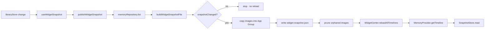

# 15 · WidgetKit architecture

**Date:** 2026-08-12 · **Branch:** `chromawave-v2` · **Status:** data path built and
compiling; end-to-end render on a simulator not yet confirmed.

Numbered 15 rather than taking `06`, which this repository already uses for the
AI recommendation architecture. The subject is new; the existing sequence is not
renumbered to accommodate it.

## The constraint everything follows from

`apps/mobile/ios/` is gitignored (root `.gitignore:11`; `git ls-files` returns
nothing under it) and regenerated by `expo prebuild`. A target added by hand in
Xcode survives until the next prebuild and then disappears — on a CI machine long
before anyone notices locally.

So the target is not a thing that exists in the project. It is a thing the
project is *derived from*:

| Committed source of truth | Generated, never committed |
| --- | --- |
| `apps/mobile/plugins/withChromawaveWidget.js` | `ios/ChromaWave.xcodeproj` |
| `apps/mobile/targets/ChromawaveWidget/*.swift` | `ios/ChromawaveWidget/` |
| `apps/mobile/modules/chromawave-shared-container/` | `ios/Pods/` |

The plugin was chosen over `@bacons/apple-targets` to avoid adding a
build-critical dependency to the one path that cannot be debugged from
JavaScript. `@expo/config-plugins` is already a transitive dependency of `expo`
at the version the SDK pins, so nothing was added to the lockfile.

## Deployment target

Unchanged at **15.1**. WidgetKit has been available since iOS 14, so raising it
would deny widgets to iOS 15 devices that can run them. `containerBackground` —
required from iOS 17, unavailable before it — is handled with an availability
check in `MemoryWidget.swift`, not by raising the floor. Live Activities need
16.1 and will be gated the same way.

## The data path



### Why the publish hangs off the store, not the repository

Six call sites write a memory — pair, save, tune, delete, set membership,
migration. Hanging the publish off `libraryStore` means all six publish without
any of them knowing the widget exists. Hanging it off
`StoredMemoryRepository.save` would have published once per record *during the
v1→v2 migration*, which is several hundred writes and several hundred timeline
reloads.

### Why reloads are content-compared

WidgetKit budgets timeline reloads per day and silently begins ignoring an app
that overspends them. `snapshotChanged` (`packages/domain/src/snapshot.ts`)
compares only what a widget renders — never `updatedAt`, which changes on every
write by definition and would make the comparison always true. Two syncs with
identical content produce exactly one reload; there is a test for it.

## The wire format

`packages/domain/src/snapshot.ts` ↔ `targets/ChromawaveWidget/Snapshot.swift`.
Schema version **1**.

Three rules, and every field is a consequence of one:

1. **The extension never computes.** Contrast (`inkHex`), band weights, ordering
   and truncation all arrive already decided. A widget that has to work out
   whether white or black reads on a colour is one that will get it wrong on
   somebody's lock screen at 6am.
2. **The extension never fetches.** No remote URL appears in the payload. The
   track's `artworkUrl` is deliberately dropped: WidgetKit renders on a timeline
   the app does not control, frequently with no network, and the provider's terms
   do not contemplate an extension hot-linking their CDN on every refresh.
3. **The extension never learns anything private.** `personalContext` — note,
   title, typed mood, tags, place name — never enters `toWidgetSnapshot`'s
   output. **Absence, not a redaction flag**: a flag can be forgotten or
   inverted, and by the time it is read the data is already in a container other
   processes can open. A test greps the serialised output for each field.

### Codable compatibility

Swift's synthesised `Decodable` fails the *whole* decode on an expected key it
cannot find, so an omitted field is a blank widget rather than a missing line.
The TypeScript side emits every key explicitly, including nulls; the Swift side
declares the nullable ones as optionals. `snapshot.test.ts`'s
"Codable compatibility" suite asserts this and is the only thing standing between
a renamed field and a blank widget in production.

### Failure tolerance

`readWidgetSnapshotFile` and `SnapshotStore.read` mirror each other:

| Input | Result | Rendered |
| --- | --- | --- |
| Valid file | `ok` | The memory |
| Missing / empty | `empty` | "No memories yet" |
| Truncated JSON | `corrupt` | "Open the app" |
| Unknown `schemaVersion` | `unsupported` | "Update Chroma Wave" |
| One bad entry among seven | `ok`, `dropped: 1` | The other six |

An unrecognised version is **refused, never best-effort decoded**. Rendering a
confident guess at an unknown shape is how wrong information reaches a lock
screen; showing the empty state is honest.

## Families

| Family | Name | Content |
| --- | --- | --- |
| `systemSmall` | Memory Pulse | Ground, palette strip, track or mood, date |
| `systemMedium` | Chromawave Memory | Composition, mood, track, artist, bands, artwork when cached |

Both render **both skins**. Swiss is not a recolour: paper ground, hard rules,
square geometry, mono metadata, and a specimen block stating the dominant hex —
the same data read as a swatch sheet rather than as a photograph.

Accessory and Large families are deliberately **not** implemented. Neither earns
its place until the resurfacing logic exists to fill them, and adding them to
claim coverage is what the brief calls a design showcase.

## A bug this architecture produced, and the fix

The first working version of the plugin passed `xcodebuild` and **broke
`pod install` completely**:

```
[Xcodeproj] Consistency issue: no parent for object `ChromawaveWidget.appex`:
            `Copy Files`, `Embed App Extensions`
```

`xcode`'s `addTarget()` registers the product through
`addProductFile(…, { group: 'Copy Files' })`, which leaves a parentless
`Copy Files` phase holding the `.appex`. `addBuildPhase` then matches on the file
reference's path and **reuses that same `PBXBuildFile`** for the embed phase, so
one build file sat in two phases.

`removeOrphanCopyPhase` drops the orphan — matched on both the phase name and its
contents, so a legitimate copy phase on the app target is never touched. The
missing `addTargetDependency` was added at the same time; without it a clean
build races and intermittently embeds nothing.

Recorded here because it is invisible to `xcodebuild` and only surfaces when pods
are installed, which is the step a native change is least likely to be tested
against.

## Verified

```
expo-modules-autolinking search  → 'chromawave-shared-container' discovered
pod install                      → Pod installation complete (125 deps, 133 pods)
scheme ChromawaveSharedContainer → ** BUILD SUCCEEDED **
scheme ChromawaveWidget          → ** BUILD SUCCEEDED **  (arm64 + x86_64)
expo prebuild ×2                 → still exactly 2 targets (idempotent)
```

591 tests pass; 0 type errors; lint and format unchanged from baseline.

## Not yet verified

- **No widget has rendered a real memory.** Every piece compiles and the logic is
  unit-tested, but the loop has not run on a device or simulator.
- **App Group provisioning.** `group.com.chromawave.app` must be registered in
  the Apple Developer portal and attached to both App IDs before a device build
  will entitle. Until then `containerPath()` returns null, `available` is false,
  and the writer is a no-op — a designed state, not a crash.
- Artwork is never cached yet, so `artworkPath` is always null and the medium
  family draws without it.

## Open decisions

| Decision | Owner |
| --- | --- |
| Register the App Group in the Apple Developer portal | Repository owner |
| Whether artwork caching is worth the storage and the licence question | Product |
| Whether Large / accessory families are wanted once resurfacing exists | Product |
